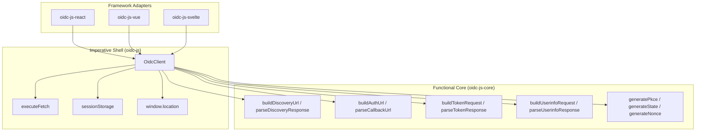

## Functional core, imperative shell

oidc-js follows the **functional core, imperative shell** pattern. The core package (`oidc-js-core`) is a set of pure functions that take data in and return data out. Framework adapters compose these functions with IO (HTTP requests, browser storage, DOM navigation).



## Package layers

### oidc-js-core

Pure functions only. No `fetch`, no `window`, no `document`. Works in any JS runtime.

- **Input**: configuration objects, raw JSON, URLs
- **Output**: typed objects, URL strings, `HttpRequest` descriptors
- **Side effects**: none (uses Web Crypto API for PKCE, which is available everywhere)

### oidc-js

The browser client. Composes core functions with:

- `fetch` for HTTP requests
- `sessionStorage` for PKCE auth state during the redirect flow
- `window.location` for navigation

The `OidcClient` class manages the OIDC lifecycle: init, login, callback, refresh, logout. It exposes a `subscribe` method for reactive state updates.

### oidc-js-react (and other adapters)

Framework-specific wrappers around `OidcClient`:

- `AuthProvider` — creates and manages the `OidcClient` lifecycle
- `useAuth` — React hook for consuming auth state
- `RequireAuth` — guard component for protected routes

Each adapter adds only the framework-specific glue. All OIDC logic lives in the core and client packages.

## Why this design?

**Testability**: Core functions can be tested with plain unit tests — no mocks, no network, no browser APIs. The E2E test suite only needs to run against the adapters.

**Portability**: The core works in Node.js, Deno, Bun, Cloudflare Workers, and any browser. Adapters target specific runtimes.

**Adapter simplicity**: A new framework adapter (Vue, Svelte, Angular) only needs to wrap `OidcClient` in framework idioms. All protocol logic is shared.

**Debugging**: When something goes wrong, you can inspect each layer independently. Core functions are deterministic — same input, same output.

## Building a custom adapter

To build an adapter for a framework not yet supported:

```typescript
import { OidcClient } from "oidc-js";

// 1. Create the client
const client = new OidcClient({
  issuer: "https://auth.example.com",
  clientId: "my-app",
  redirectUri: "http://localhost:5173/callback",
  scopes: ["openid", "profile", "email", "offline_access"],
});

// 2. Subscribe to state changes
client.subscribe((state) => {
  // Update your framework's reactive state
  // state.user, state.isAuthenticated, state.tokens, etc.
});

// 3. Initialize (fetches discovery, handles callback if present)
await client.init();

// 4. Login / logout / refresh
await client.login();
client.logout();
await client.refresh();

// 5. Clean up
client.destroy();
```

The `OidcClient` API is framework-agnostic. Your adapter just needs to bridge `subscribe` into your framework's reactivity system.
