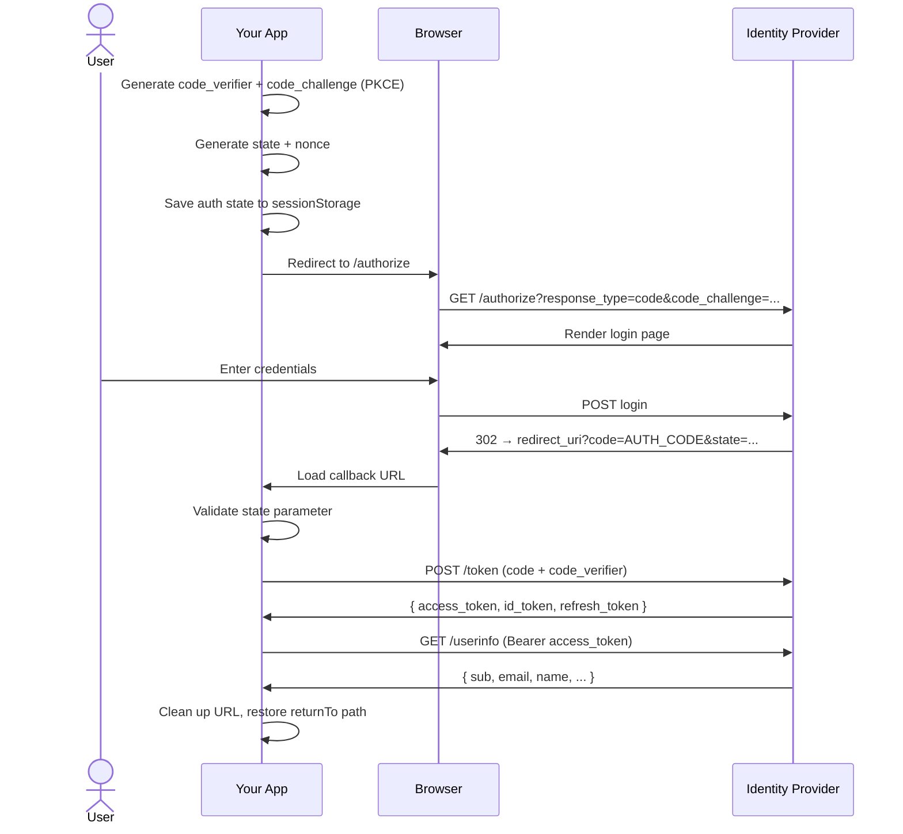

import { Aside, Tabs, TabItem } from "@astrojs/starlight/components";

The Authorization Code flow with PKCE (Proof Key for Code Exchange, RFC 7636) is the recommended grant type for browser-based applications. It's the only flow oidc-js supports — no implicit flow, no client credentials in the browser.

## Flow overview



## Why PKCE?

Without PKCE, anyone who intercepts the authorization code (via browser history, referrer headers, or a compromised redirect) can exchange it for tokens. PKCE prevents this:

1. The app generates a random `code_verifier` and computes its SHA-256 hash (`code_challenge`)
2. The `code_challenge` is sent with the authorization request
3. The `code_verifier` is sent with the token exchange
4. The IdP verifies that `SHA256(code_verifier) == code_challenge`

An attacker with only the authorization code can't complete the exchange because they don't have the `code_verifier`.

## Step by step

### 1. Generate PKCE parameters

oidc-js uses the Web Crypto API for all cryptographic operations:

```typescript
import { generatePkce, generateState, generateNonce } from "oidc-js-core";

const pkce = await generatePkce();
// pkce.verifier = random 32-byte base64url string
// pkce.challenge = SHA-256(verifier) as base64url

const state = generateState();  // CSRF protection
const nonce = generateNonce();  // ID token replay protection
```

### 2. Build the authorization URL

```typescript
import { buildAuthUrl } from "oidc-js-core";

const url = buildAuthUrl(discovery, config, pkce, state, nonce);
// https://auth.example.com/authorize?
//   response_type=code
//   &client_id=my-app
//   &redirect_uri=http://localhost:5173/callback
//   &scope=openid+profile+email
//   &state=abc123
//   &nonce=def456
//   &code_challenge=E9Melhoa2OwvFrEMTJguCHaoeK1t8URWbuGJSstw-cM
//   &code_challenge_method=S256
```

### 3. User authenticates

The IdP renders its login page. After successful authentication, it redirects back:

```
http://localhost:5173/callback?code=AUTH_CODE&state=abc123
```

### 4. Validate the callback

```typescript
import { parseCallbackUrl } from "oidc-js-core";

const { code } = parseCallbackUrl(window.location.href, expectedState);
// Throws STATE_MISMATCH if state doesn't match
// Throws AUTHORIZATION_ERROR if URL contains ?error=...
```

### 5. Exchange the code for tokens

```typescript
import { buildTokenRequest, parseTokenResponse } from "oidc-js-core";

const req = buildTokenRequest(discovery, config, code, pkce.verifier);
const response = await fetch(req.url, {
  method: req.method,
  headers: req.headers,
  body: req.body,
});
const tokenSet = parseTokenResponse(await response.json(), nonce);
// tokenSet.access_token, tokenSet.id_token, tokenSet.refresh_token
```

<Aside type="tip">
In practice, you don't need to call these functions manually — `AuthProvider` handles the entire flow. This page explains what happens under the hood.
</Aside>

## Security properties

| Protection | Mechanism |
|---|---|
| **CSRF** | `state` parameter validated on callback |
| **Code interception** | PKCE `code_verifier` required for token exchange |
| **Token replay** | `nonce` embedded in ID token and validated |
| **Token storage** | Tokens stored in memory only, never `localStorage` |
| **XSS mitigation** | No tokens in persistent browser storage |
