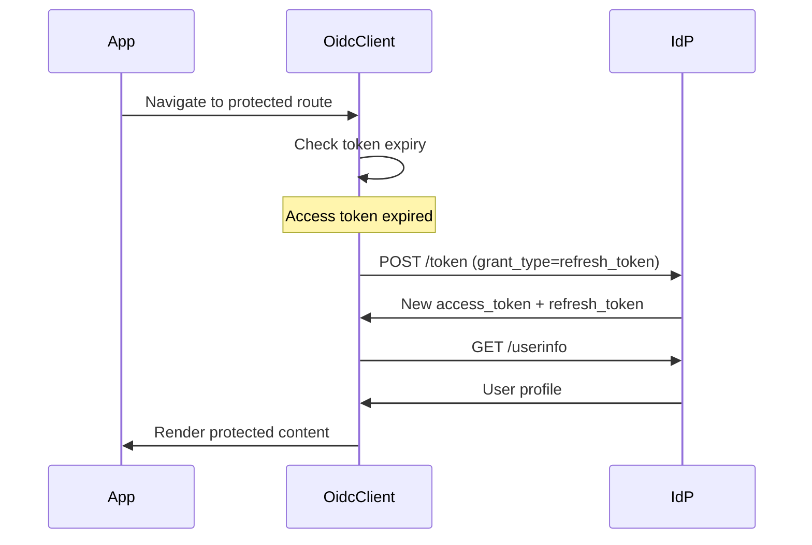

import { Aside } from "@astrojs/starlight/components";

## How refresh works

When the access token expires, oidc-js uses the refresh token to obtain a new access token without requiring the user to log in again.



## Automatic refresh with RequireAuth

`RequireAuth` handles refresh automatically. When a user navigates to a protected route with an expired token:

1. Checks `tokens.expiresAt` using `isExpiredAt()` from core (with an optional buffer)
2. If expired, calls `actions.refresh()`
3. If refresh succeeds, renders the children with new tokens
4. If refresh fails, redirects to login

```tsx
<RequireAuth>
  <Dashboard />
</RequireAuth>
```

You can set an `expiryBuffer` (in seconds) on the provider config to refresh the token early, accounting for clock skew and network latency. The default buffer is 30 seconds.

```tsx
<AuthProvider config={{ ...config, expiryBuffer: 60 }}>
  <App />
</AuthProvider>
```

## Manual refresh

You can also trigger a refresh manually:

```tsx
import { useAuth } from "oidc-js-react";

function RefreshButton() {
  const { actions } = useAuth();

  async function handleRefresh() {
    try {
      await actions.refresh();
    } catch (error) {
      console.error("Refresh failed:", error);
    }
  }

  return <button onClick={handleRefresh}>Refresh Token</button>;
}
```

## Checking token expiry

The `tokens` object from `useAuth` includes expiry information:

```tsx
const { tokens } = useAuth();

// Unix timestamp in seconds when the access token expires
console.log(tokens.expiresAt);
```

Use the helper functions from `oidc-js-core` to work with token expiry:

```tsx
import { isExpiredAt, timeUntilExpiry } from "oidc-js-core";

const { tokens } = useAuth();

// Check if expired (includes a default 30-second buffer)
const expired = isExpiredAt(tokens.expiresAt);

// Check with a custom buffer (in seconds)
const expiringSoon = isExpiredAt(tokens.expiresAt, 120);

// Get seconds remaining until expiry
const secondsLeft = timeUntilExpiry(tokens.expiresAt);
```

<Aside type="note">
The `expiresAt` value is extracted from the `exp` claim in the JWT access token as a Unix timestamp in seconds. If the access token is not a JWT or doesn't contain an `exp` claim, `expiresAt` will be `null`.
</Aside>

## Requesting a refresh token

To receive a refresh token, include `offline_access` in your scopes:

```tsx
const config = {
  issuer: "https://auth.example.com",
  clientId: "my-app",
  redirectUri: "http://localhost:5173/callback",
  scopes: ["openid", "profile", "email", "offline_access"],
};
```

Without `offline_access`, the IdP may not issue a refresh token, and `actions.refresh()` will throw.
