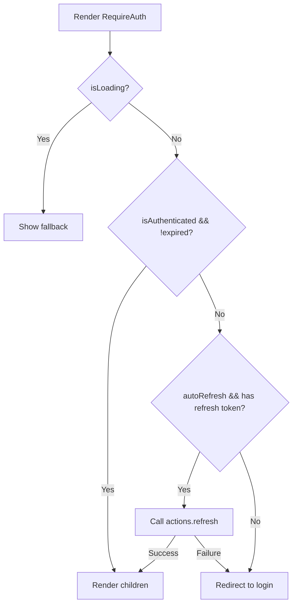

`RequireAuth` is a guard component that ensures its children are only rendered when the user is authenticated. It handles token expiry and automatic refresh.

## Usage

```tsx
import { RequireAuth } from "oidc-js-react";

function ProtectedPage() {
  return (
    <RequireAuth>
      <h1>Protected Content</h1>
    </RequireAuth>
  );
}
```

## Props

| Prop | Type | Default | Description |
|---|---|---|---|
| `children` | `ReactNode` | **required** | Content to render when authenticated |
| `fallback` | `ReactNode` | `null` | Shown while loading or redirecting |
| `autoRefresh` | `boolean` | `true` | Auto-refresh expired tokens before redirecting to login |
| `loginOptions` | `LoginOptions` | — | Options passed to `actions.login()` when redirecting |

## Behavior



When a user navigates to a protected route:

1. If still loading (discovery, callback), render `fallback`
2. If authenticated with a valid token, render `children`
3. If the token is expired and `autoRefresh` is `true`, attempt a silent refresh
4. If refresh succeeds, render `children` with the new token
5. If refresh fails (or no refresh token), redirect to the IdP login

## Deep linking

`RequireAuth` preserves the current URL when redirecting to login. After the user authenticates, they return to the page they originally requested.

```tsx
// User visits /dashboard/settings while unauthenticated
// → Redirected to IdP login
// → After login, returned to /dashboard/settings
<RequireAuth>
  <Settings />
</RequireAuth>
```

## With React Router

```tsx
import { Routes, Route } from "react-router-dom";
import { RequireAuth } from "oidc-js-react";

<Routes>
  <Route path="/" element={<Home />} />
  <Route path="/dashboard" element={
    <RequireAuth fallback={<Spinner />}>
      <Dashboard />
    </RequireAuth>
  } />
</Routes>
```
